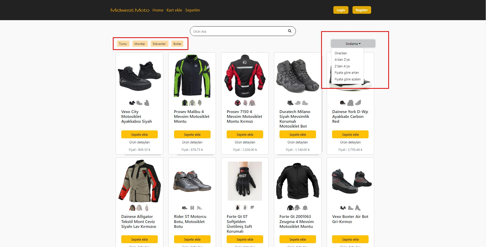
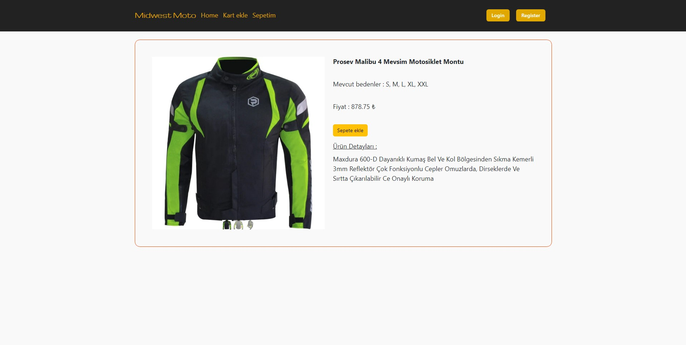
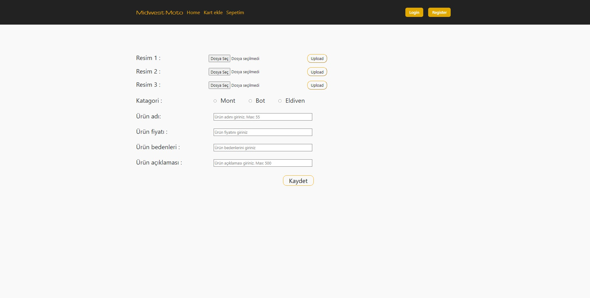
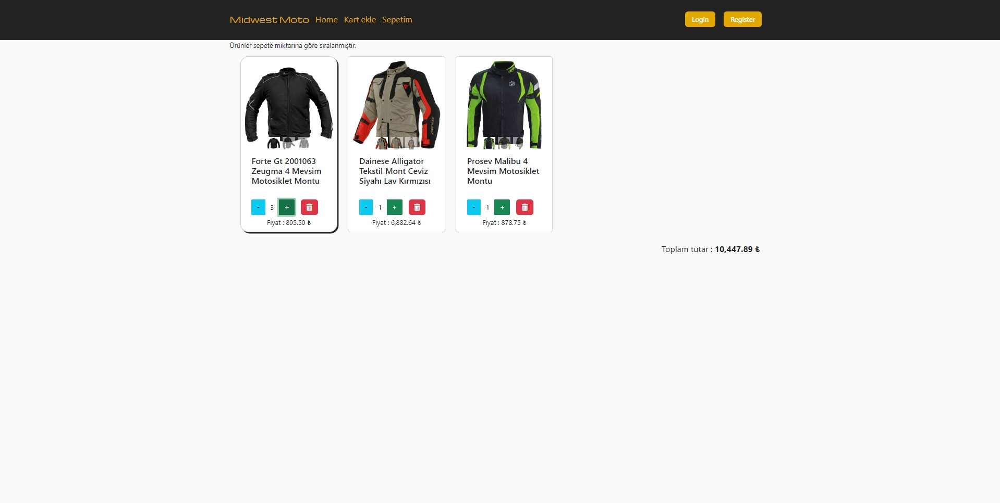
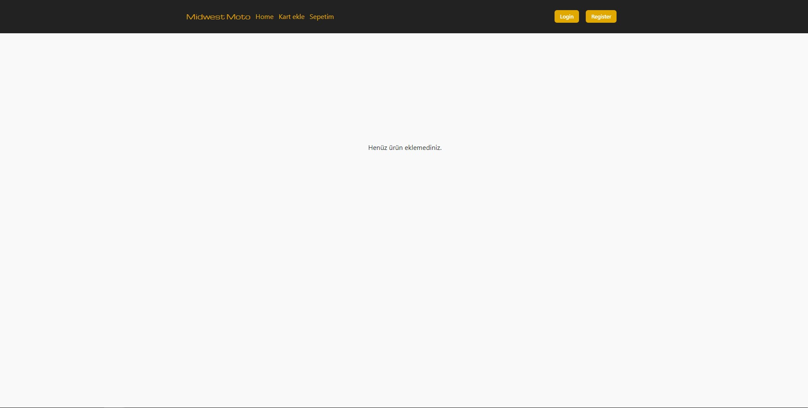
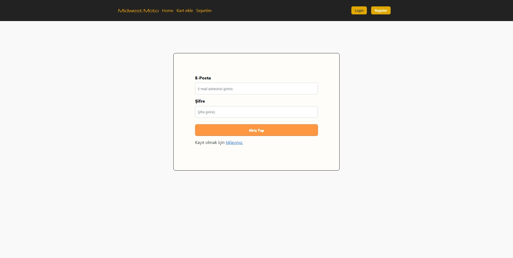
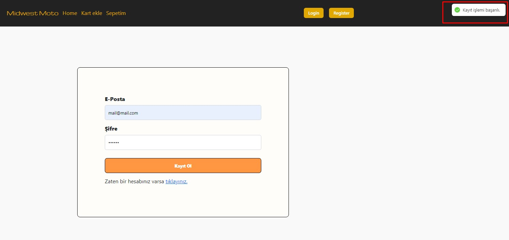
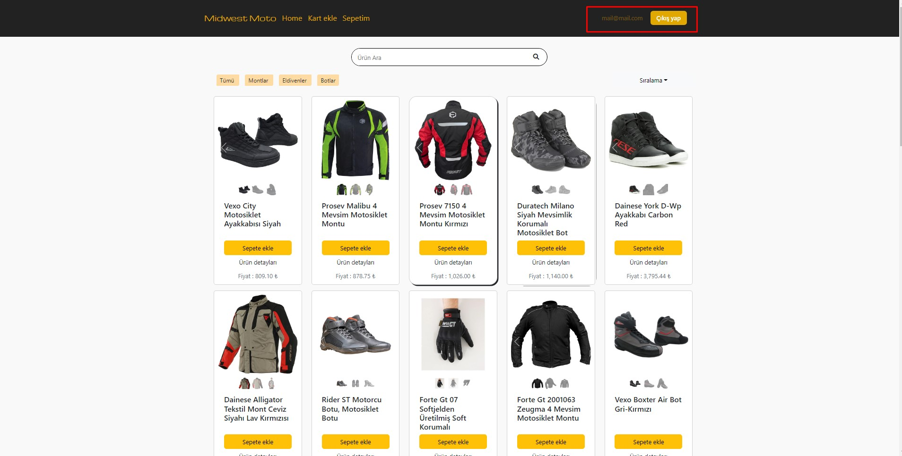

# MIDWEST MOTO 

Live : MIDWEST MOTO

<h3><u>Dipnote : The site is designed as 1920x1080. There may be deterioration in other screen resolutions.</u></h3>

<ol><h3>-->Technologies</h3>
<li> React</li>
<li> Redux</li>
<li> Firebase@8</li>
<li> Bootstrap</li>
<li> React-router-dom</li>
<li> React-hot-toast</li></ol>

<h3> if you want to clone repo you can write this in terminal</h3>

````
git clone https://github.com/semihalperKeskin/MIDWESTMOTO.git
npm i
npm i firebase@8
npm i react-router-dom
npm i react-hot-toast
````

## some project image


- ### Home page and sortig options



---

- ### Product Detail page


---
- ### Card add page

#### firstly you choise image and then press upload button then you can write other detail your product


---

- ### Basket page
#### if you add products in basket


#### empty basket


---
- ### Login and Register page
#### Login

#### Register


---

- ### Toast error and success
#### Error

#### Success


---
- ### Login with Home page


